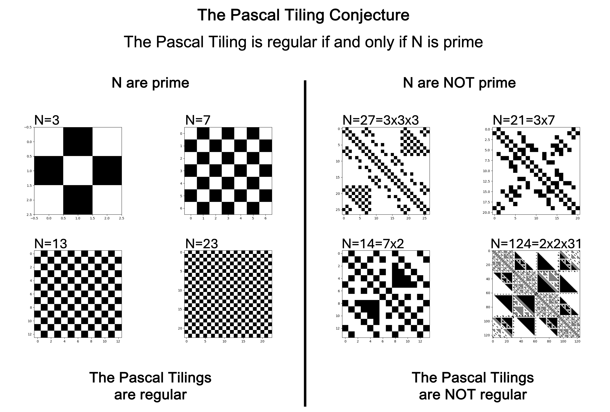
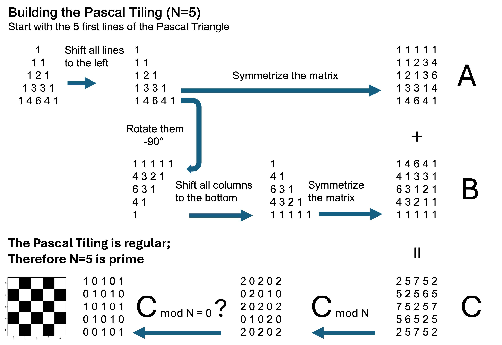
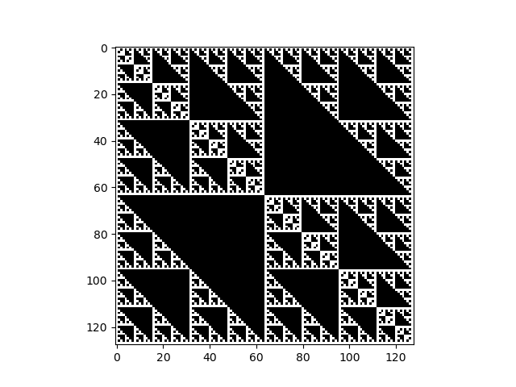
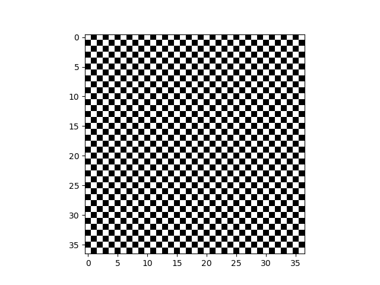
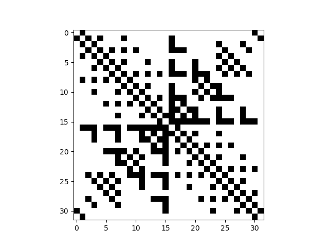

# Le Damier de Pascal

Ce dépôt présente mon travail sur une conjecture liant les propriétés du triangle de Pascal et les nombres premiers.

Ce travail a débuté en Avril 2025, à l'occasion de la préparation du Grand Oral des épreuves du baccalauréat.

Le triangle de Pascal est connu pour faire apparaître de nombreuses structures étonnantes lorsqu'on le représente modulo $q$ où $q$ est un nombre premier.

En manipulant les $N$ premières lignes du triangle de Pascal, et en prenant le modulo $N$ , j'ai vu apparaitre une structure régulière lorsque $N$ est un nombre premier, alors que la structure reste irrégulière lorsque $N$ n'est pas un nombre premier.

Le Damier de Pascal **est régulier** pour le nombre premier $N=37$.

Le Damier de Pascal **n'est pas régulier** pour le nombre premier $N=32$.

Pour construire la matrice carrée de dimension N×N souhaitée, on commence par extraire les N premières lignes du Triangle de Pascal en forme d’escalier, aligné à gauche. Ces lignes servent à former une première matrice, que l’on complète par une symétrie diagonale (par rapport à la diagonale principale).

Pour obtenir une seconde matrice, on considère cette fois les N premières lignes du Triangle de Pascal aligné à droite. On inverse alors l’ordre des lignes : la première devient la dernière, la deuxième devient l’avant-dernière, et ainsi de suite, jusqu’à obtenir une version reflétée verticalement. que l’on complète également par une symétrie diagonale (par rapport à la diagonale principale).

C'est en additionnant les deux matrices que l'on obtient notre matrice carrée de dimensions NxN. Cette matrice nous permet de créer des images ou l'on mettra un pixel noir quand l'on tombe sur un multiple de N et un pixel noir quand le nombre n'est pas un multiple. 

On définie un Damier régulier par 2 règles:

- Le pixel en haut à gauche est blanc
- Tous les pixels sont entourés verticalement et horizontalement par des pixels de couleur opposée : un pixel blanc ne peut être adjacent qu’à des pixels noirs, et inversement.

Il en découle l'équivalence suivante:

**Pour N>2, N est premier si et seulement si on obtient un Damier régulier**

Lorsque $N$ n'est pas premier, la Damier est irrégulier et laisse apparaître une structure proche des structures fractales habituellement observées avec le triangle de Pascal modulo q.

La démonstration de cette conjecture est en cours de vérification. Si elle se confirme la conjecture du Damier de Pascal deviendra un théorème.

